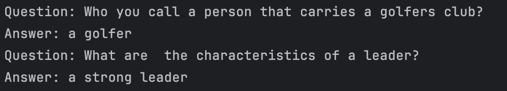

# Fine-Tuning FLAN-T5 on YahooAnswers Dataset
## 0. Overview 
The goal of this project is to prepare a new dataset based on the YahooAnswers dataset, fine-tune the FLAN-T5 language model on this dataset, and create some question-answer exchange with the new LLM over the terminal. The project includes examples of old and new answers to the same questions and the corresponding evaluation metric.

## 1. Preparation 
The first step is to test several FLAN-T5 model responses to basic user questions found in the YahooAnswers dataset.
The script for this contains in main.py

Example output:
