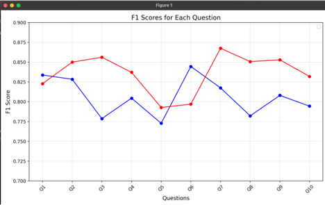

# Fine-Tuning FLAN-T5-base on YahooAnswers Dataset
## Overview 
The goal of this project is to prepare a new dataset based on the YahooAnswers dataset, fine-tune the FLAN-T5-base language model on this dataset, and create some question-answer exchange with the new LLM over the terminal. 
The project includes examples of old and new answers to the same questions and the corresponding evaluation metric.

## Installation
 Clone this repository and install packages from requirements.txt.
```bash
git clone https://github.com/ArzhkvJl/yahoo-answers-processing  <my-folder>
cd <my-folder>
pip install -r requirements.txt
```
## Usage

```bash
# Start fine-tuning process and save a new model
python fine-tuning.py

# Ask questions to trained model 
python start_qa.py
```

## 1. Preparing training dataset
There are several YahooAnswers dataset in the net. I copied one of them, added the column titles and pushed it into HuggingFace Datasets as huggingface.

## 2. Fine-tunung
The script fine-tuning.py consists steps to perform a fine-tuning.

Updating training dataset by selecting only several rows to avoid OutOfMemory exceptions. 
Data preprocessing also includes converting the dataset into a format suitable for the question-answering task.
Then loading the tokenizer, model, and data collator, setting training arguments and starting a train loop.
While this process all metrics are showing in the https://wandb.ai. But due to the lack of memory I had to implement this process without compute_metrics parameter. Instead, I used a simple function from script "bert-score.py" to check this metric for some model answers.
Output from the https://wandb.ai:


Loss of the two best checkpoints:


BERTScore evaluates the semantic similarity between the generated predictions and the references. So I add several trained models into this script and found the best checkpoint (red one on the picture).


After choosing the best checkpoint and comparing its answers with the answers of flan-t5 this was pushed to HuggingFace Hub as "JuliaTsk/flan-t5-base-finetuned".

Comparing answers:

```python
# Example question
example = "why doesn't an optical mouse work on a glass table? "
example1 = "Why does Zebras have stripes?"
example2 = "What's the capital of French?"
```


## Results
The model FLAN-T5-base was trained on YahooAnswers dataset using transformers.
Metrics for two best checkpoints:
| Checkpoint | #1      | #2    |
| -----------| ------- | ----- |
| Loss       | 0.6365  | 0.5668|
| BERT-score | 0.8065  | 0.8359|

Second is  the best one.


